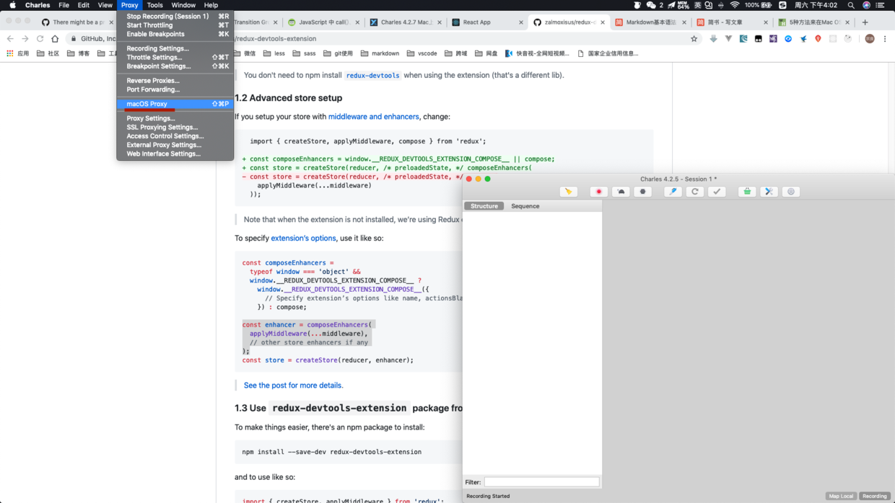
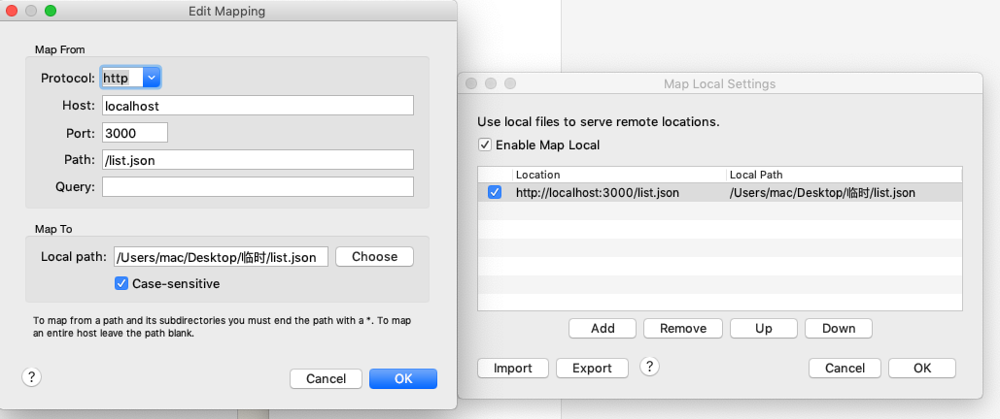

> 对于前端来说，postman和charles都是必备工具。今天就来说一下charles本地数据模拟（本人是MAC端）

# 第一步
* 下载安装[charles](https://xclient.info/s/charles.html#versions) 
 
# 第二步  

*  确保自己打开maxos Proxy
   

# 第三步 
`左上角Tools > Map Local >`

Local Path 配置本地mock数据

# 注意事项：
* 如若无法访问数据
1 优先关掉代理上网等软件，
2 设置`左上角Help > SSL proxying > Install Charles Root Certificate`

 

